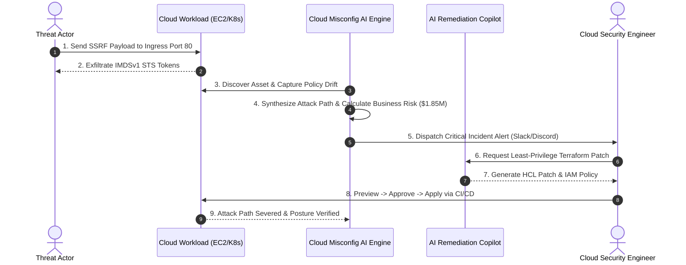
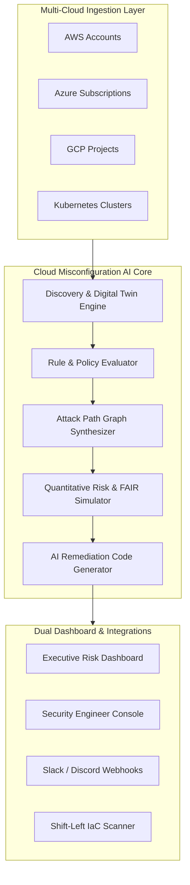

# 📐 System Architecture Diagrams (Mermaid.js Suite)

---

## 1. End-to-End Sequence Flow

```mermaid
sequenceDiagram
    autonumber
    actor Attacker as Threat Actor
    participant Cloud as Cloud Workload (EC2/K8s)
    participant Engine as Cloud Misconfig AI Engine
    participant Copilot as AI Remediation Copilot
    actor Admin as Cloud Security Engineer

    Attacker->>Cloud: 1. Send SSRF Payload to Ingress Port 80
    Cloud-->>Attacker: 2. Exfiltrate IMDSv1 STS Tokens
    Engine->>Cloud: 3. Discover Asset & Capture Policy Drift
    Engine->>Engine: 4. Synthesize Attack Path & Calculate Business Risk ($1.85M)
    Engine->>Admin: 5. Dispatch Critical Incident Alert (Slack/Discord)
    Admin->>Copilot: 6. Request Least-Privilege Terraform Patch
    Copilot-->>Admin: 7. Generate HCL Patch & IAM Policy
    Admin->>Cloud: 8. Preview -> Approve -> Apply via CI/CD
    Cloud-->>Engine: 9. Attack Path Severed & Posture Verified
```

---

## 2. Component Layer Architecture

```mermaid
graph TD
    subgraph MultiCloud ["Multi-Cloud Ingestion Layer"]
        AWS[AWS Accounts]
        AZ[Azure Subscriptions]
        GCP[GCP Projects]
        K8s[Kubernetes Clusters]
    end

    subgraph CoreEngine ["Cloud Misconfiguration AI Core"]
        Discovery[Discovery & Digital Twin Engine]
        Rules[Rule & Policy Evaluator]
        GraphBuilder[Attack Path Graph Synthesizer]
        FAIR[Quantitative Risk & FAIR Simulator]
        CopilotEngine[AI Remediation Code Generator]
    end

    subgraph PresentationLayer ["Dual Dashboard & Integrations"]
        ExecDash[Executive Risk Dashboard]
        EngDash[Security Engineer Console]
        Webhooks[Slack / Discord Webhooks]
        IaCView[Shift-Left IaC Scanner]
    end

    MultiCloud --> Discovery
    Discovery --> Rules
    Rules --> GraphBuilder
    GraphBuilder --> FAIR
    FAIR --> CopilotEngine
    CopilotEngine --> PresentationLayer
```
