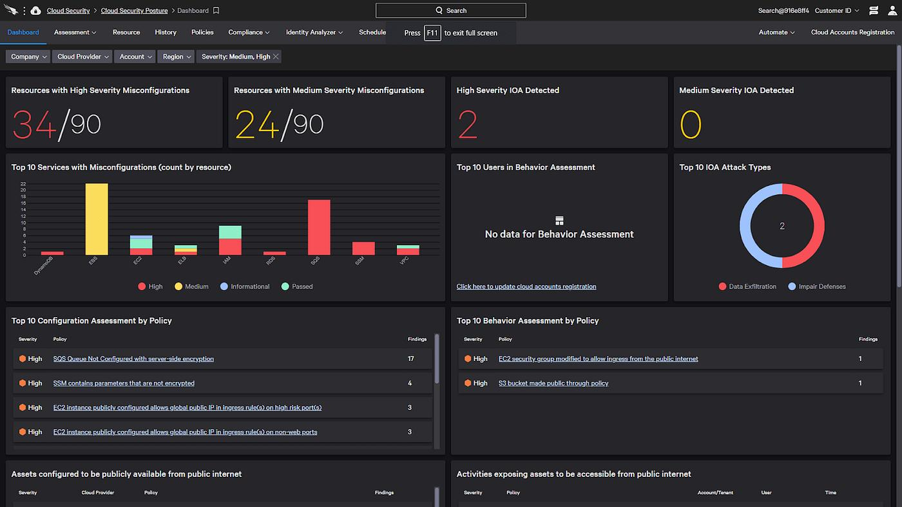

# 🚀 LinkedIn Project Launch & Showcase Post

Use this ready-to-publish copy and image assets for announcing **Cloud Misconfiguration AI** on LinkedIn.

---

## 🖼️ Attached Showcase Image


---

## 🌟 Variant 1: High-Impact Viral Launch Post (Recommended)

```markdown
🚨 Stop telling security teams that 127 cloud vulnerabilities exist. 
Tell them which weakness can cause the most business damage—and exactly what to fix first. ☁️🛡️

Most Cloud Security Posture Management (CSPM) tools treat an unencrypted test S3 bucket and an unencrypted production customer database backup with the exact same severity.

The result? Alert fatigue, blind spots, and catastrophic breaches.

To solve this, I built **Cloud Misconfiguration AI** — an autonomous AI Cloud Security Engineer that continuously maps multi-cloud infrastructure, synthesizes multi-hop attack paths, and quantifies risk based on Business Impact rather than just raw CVSS.

🧠 Key Capabilities:
1️⃣ 🕸️ **Interactive Attack-Path Graph:** Connects low/medium findings into a single critical exploit chain (Internet ➔ Ingress ➔ SSRF ➔ Wildcard IAM ➔ Crown Jewel Database).
2️⃣ 💰 **Business Risk Engine:** Combines Technical Severity × Asset Criticality × Data Sensitivity × Exposure × Financial Value-at-Risk ($).
3️⃣ 🛠️ **AI Remediation Copilot:** 3-step safe workflow (Preview ➔ Approve ➔ Apply) generating least-privilege Terraform (.tf), CloudFormation, and IAM JSON policies.
4️⃣ 🎯 **MITRE ATT&CK® Cloud Matrix v14:** Real-time adversary TTP heatmap mapping.
5️⃣ 🔍 **Shift-Left IaC Scanner:** Static security analyzer for Terraform and Kubernetes manifests.
6️⃣ 📈 **Configuration Drift Timeline:** Live event-driven monitor for unauthorized cloud policy changes.
7️⃣ 🛡️ **Automated Compliance Matrix:** Real-time audit scoring for CIS Benchmarks v3.0, NIST SP 800-53, SOC 2 Type II, ISO 27001, and PCI DSS 4.0.

💻 Built with: Node.js, React 19, Vite, TailwindCSS, Docker, Python SDK & GitHub Actions.

⭐ Check out the open-source repository on GitHub:
👉 https://github.com/vijaymahes9080/Cloud-Misconfiguration-AI

I'd love to hear your feedback from Cloud Security Engineers, CISOs, and DevSecOps practitioners! What is your biggest challenge with CSPM alerts today?

#CloudSecurity #CyberSecurity #DevSecOps #AWS #Azure #GCP #Terraform #OpenSource #AI #InformationSecurity #CSPM #SoftwareEngineering #Python #React
```

---

## 🔬 Variant 2: Deep-Dive Architecture & Engineering Post

```markdown
🔍 Under the hood of an AI Cloud Security Engineer: How to synthesize Multi-Hop Attack Graphs from raw cloud configurations.

When evaluating cloud security posture, isolated resource checks fail because modern breaches exploit connected trust relationships.

In **Cloud Misconfiguration AI**, we modeled cloud topology as a directed graph $G = (V, E)$ where:
* Vertices $V$ represent Compute (EC2/K8s), IAM Identities, Storage (S3/Blob), and Databases.
* Edges $E$ represent Network Ingress, AssumeRole trust boundaries, and IAM privilege reachability.

We then formulated a multi-factor Business Risk Score:
$$\text{Business Risk} = \text{Technical Severity} \times \text{Asset Criticality} \times \text{Data Sensitivity} \times \text{Exposure} \times \text{Exploitability} \times \text{Business Dependency}$$

Combined with a FAIR-based Monte Carlo simulator running 1,000 probabilistic iterations to calculate annualized Value-at-Risk (VaR), the engine enables security teams to sever exploit paths before attackers reach Crown Jewel assets.

Explore the complete architecture and test suites:
🔗 https://github.com/vijaymahes9080/Cloud-Misconfiguration-AI

#CloudArchitecture #CyberRisk #FAIR #AttackGraph #MultiCloud #DevSecOps #Kubernetes #InfraAsCode
```

---

## 🎓 Variant 3: Academic / Final-Year MCA Defense Post

```markdown
🎓 Excited to present my MCA Final-Year Capstone Project: **Cloud Misconfiguration AI — Next-Generation AI Cloud Security Engineer**.

Traditional vulnerability scanners overwhelm administrators with hundreds of disconnected alerts without context. This research project introduces an intelligent platform that:
✅ Automatically discovers multi-cloud asset inventories (AWS, Azure, GCP).
✅ Builds a real-time Digital Twin and directed Attack-Path Graph.
✅ Prioritizes remediation by business liability ($) and data sensitivity.
✅ Generates automated Terraform and IAM least-privilege patches.
✅ Maps findings to CIS, NIST, SOC 2, and ISO 27001 compliance standards.

Full research documentation, IEEE LaTeX manuscript, and open-source codebase:
👉 https://github.com/vijaymahes9080/Cloud-Misconfiguration-AI

Special thanks to my mentors and peers for their guidance!

#MCA #FinalYearProject #CyberSecurityResearch #CloudComputing #MachineLearning #DevSecOps #ResearchPaper
```
